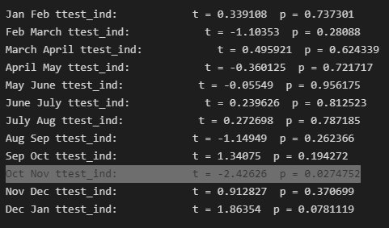

# Online Retail Store

The idea of the project is to perform forecasting analytics and derive recommendations for the stocking the goods and staffing to meet the future demands. Based on the time of the year,month and day of the year.

## Introduction

A gift retail store, which has majority of customers as wholesalers. We want to be sure to have enough items in stock and be ready for the seasonal trends and surge in orders during the holiday seasons. The dataset contains transactions between 1/12/2009 and 9/12/2011. Our goal is to be able to come up with a model that would be able to accurately predict the total number of orders that we can expect in the coming days. This will help the business to be prepared for any hiring or packing requirements needed.

### Sales Case study

**Problem Statement** – How can the online gift retail store better stock up the goods in order to meet the growing demands?

**Context** – Online gift retail store has a significant presence in UK and ships internationally too. It is a wholesaler for gifts with over 4646 unique items. 

**Criteria for success** – The future sales should be in under acceptable error rate < 5%

**Constraints** – The customerId is doesn’t tell much about the customers information. The dataset is restricted to only the records we have received.

**DataSource** - [UCI Machine Learning Repository: Online Retail II Data Set](https://archive.ics.uci.edu/ml/datasets/Online+Retail+II)

**Stakeholders** – Raghu Pattar

## Data Insights and Cleaning

In this process, I superfically analyzed the data inorder to understand what format the data is going to be and which changes are supposed to be made. The dataset contains approximately 1.06 million records for the transactions between 1/12/2009 and 9/12/2011. Our gift retail store received orders from almost 42 other countries apart from UK and served 4646 unique gift items on sale.

* **Problem 1:** The data contained records with (-ve) quantity which was associated with the returns for the order items or cancelled invoices and there were null customerId. **Solution:-** Drop records which belongs to returns or cancellation. As it would be a noise inorder for performing the forecasting.

* **Problem 2:** A few of the records had price set as 0 incorrectly. **Solution:-** Compute the median prices for the items based on their category,

* **Problem 3:** The dataset contained almost 90% of orders coming in from UK and only 10% which belonged to rest of the 42 countries. **Solution:-** Split the dataset into 2 different datasets - UK and Non-UK dataset. 

* **Problem 4:** CustomerId is null for almost 23% of the records. Since there was no associated customer information. It was best to drop these columns. 

## Exploratory Data analysis

In this step our goal is to further analyze and take a detailed look at the data presented to us. I try and look at which products are most bought from the store and how the price distribution of different products in the store. My further analysis included visualizing the sales pattern in different weeknumbers, days in a month and different hours of the day. I discovered that only 1% of the orders belonged to rest of the 42 countries. ~820k orders belonged to UK and so the exploratory analysis and cleaning activities were performed separated based on UK and the rest of the countries together. 

 

From the above graph we can see that majority of the collections were performed on Thursday by the store followed by Tuesday. 
Below I look at the orders placed based on different timeframes and can see a significant jump towards the last quarter of the year (especially during October and November). This could be probably associated with holiday season (Christmas) coming in December. To enhance our backing, I have also incorporated the UK holiday list since that contains most of the transactions

### Statistical Testing 

Performing Statistical test to back our hypothesis. The null hypothesis is that there isn’t any difference in the sales pattern across adjacent months and the vica versa for alternative hypothesis. After the statistical testing it was clear that we couldn’t reject the null hypothesis since there wasn’t any difference in other months except for Oct-Nov.

Performing Statistical test to back our hypothesis. The null hypothesis is that there isn’t any difference in the sales pattern across adjacent months and the vica versa for alternative hypothesis. After the statistical testing it was clear that we couldn’t reject the null hypothesis since there wasn’t any difference in other months except for Oct-Nov.

My exploratory analysis was concluded with featuring engineering techniques which included adding different columns to the original dataset so that it can used for training the model more efficiently

### Feature Engineering & Predictve Power Score(PPS)

In this using feature engineering approach and based on the data analyzed. I created multiple columns which is used for feeding into the Machine Leanring algorithm. 

•	Total amount of sales done in a day
•	Unique orders per day
•	Average amount of collections per day
•	Pre 7 and Pre 30 days orders 
•	Is_holiday
•	Marking any outlier sales_boost received on a particular day.

This ended with a Predicitve Power score (PPS) which is very good in finding out non-linear relationships amongs different columns which wouldn’t be achieved in a regular correlational matrix.

In order to achieve our goal we select the columns which are highly related to our predictor variable ‘Post_30_orders’. We can see a significant difference in the way how our columns are related across 2 data subsets.

## Pre-Processing

In this process we handle the pre modeling by feeding the relevant columns to pycaret regressor to predict the best available outcomes. Since the dataset has a wide range of categorical variables, it was excluded from the features. The dataset consists of 4646 unique items and would lead to a huge list of columns based on one-hot encoding. The test size was set to 20% of the entire data. Pycaret setup was done on
 numeric_features - ['counts', 'TotalPrice', 'Average_Price', 'Pre_wk_orders','Pre_30_orders',Month','Year', 'Day', 'Weeknumber']

From the above pycaret regressor techniques we can most certainly say that Tree based Regressor performed the best for our initial process. However, when the same trained model was applied on Remaining Countries dataset it performed poorly and it is directly associated with the relationship between the columns with Post_30_orders. Further optimization techniques are carried out in the modeling section. 

## Modeling

In this section we are going to use RandomForestRegressor (RF) as our base model for predicting Post_30_orders as that is the ML model that gave the best base results. However, to further improve and better train the model we are going to use different hyperparameter tuning to find the best estimators for the RF to get the lowest RSME error. 
After using the best estimators, we get a perfect RMSE score on the UK dataset. I validated the model with different random states as well inorder ensure that the scores are same as what I received from the previous approach.

However, the same was not true for NonUK dataset. I can see that there is a high RMSE score and proves that the model is not good enough to predict on different dataset.

This is because the model is biased due to high number of records in the UK datasubset. 
Inorder to remove this bias I am going to combine both the datasets (UK and NonUK) and use a Voting regressor that fits several base regressors, each on the whole dataset. Then it averages the individual predictions to form a final prediction.

This combined model is now effective in accurately predicting the data from both the subsets with high accuracy and can be seen since when I compare the R2 score of the individual RF model with that to the output of the Voting Regressor. 

The below R2 score is seen when we predict it on NonUK dataset using the VotingRegressor. 

This shows that there has been a tremendous improvement in the output. 

Project Organization
------------

    ├── LICENSE
    ├── Makefile           <- Makefile with commands like `make data` or `make train`
    ├── README.md          <- The top-level README for developers using this project.
    ├── data
    │   ├── external       <- Data from third party sources.
    │   ├── interim        <- Intermediate data that has been transformed.
    │   ├── processed      <- The final, canonical data sets for modeling.
    │   └── raw            <- The original, immutable data dump.
    │
    ├── docs               <- A default Sphinx project; see sphinx-doc.org for details
    │
    ├── models             <- Trained and serialized models, model predictions, or model summaries
    │
    ├── notebooks          <- Jupyter notebooks. Naming convention is a number (for ordering),
    │                         the creator's initials, and a short `-` delimited description, e.g.
    │                         `1.0-jqp-initial-data-exploration`.
    │
    ├── references         <- Data dictionaries, manuals, and all other explanatory materials.
    │
    ├── reports            <- Generated analysis as HTML, PDF, LaTeX, etc.
    │   └── figures        <- Generated graphics and figures to be used in reporting
    │
    ├── requirements.txt   <- The requirements file for reproducing the analysis environment, e.g.
    │                         generated with `pip freeze > requirements.txt`
    │
    ├── setup.py           <- makes project pip installable (pip install -e .) so src can be imported
    ├── src                <- Source code for use in this project.
    │   ├── __init__.py    <- Makes src a Python module
    │   │
    │   ├── data           <- Scripts to download or generate data
    │   │   └── make_dataset.py
    │   │
    │   ├── features       <- Scripts to turn raw data into features for modeling
    │   │   └── build_features.py
    │   │
    │   ├── models         <- Scripts to train models and then use trained models to make
    │   │   │                 predictions
    │   │   ├── predict_model.py
    │   │   └── train_model.py
    │   │
    │   └── visualization  <- Scripts to create exploratory and results oriented visualizations
    │       └── visualize.py
    │
    └── tox.ini            <- tox file with settings for running tox; see tox.readthedocs.io

